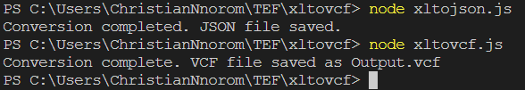

# XLSX to VCF and Excel to JSON Converter

This Node.js script provides functionality to convert XLSX files to VCF (vCard) and Excel files to JSON.

## Prerequisites

Before using this script, make sure you have Node.js installed on your machine. You can download it from [nodejs.org](https://nodejs.org/).

## Installation

1. Clone the repository:

   ```bash
   git clone https://github.com/your-username/your-repository.git

2. Install dependencies

    ```bash
    npm install

## Usage

```bash
    node xltojson.js
```

```bash
    node xltojson.js
```


